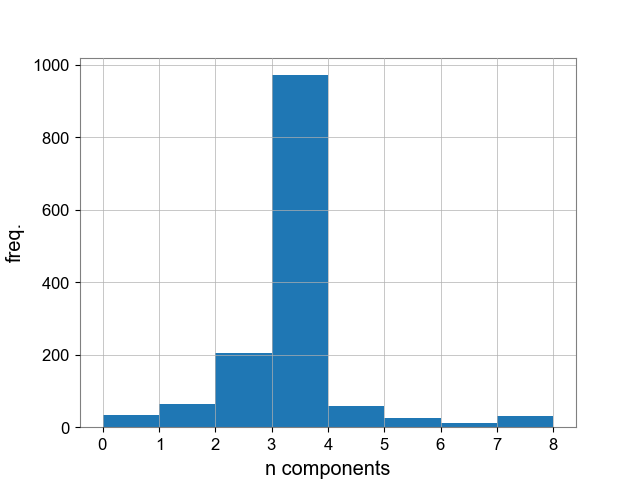

# tBilby

**This is the tBilby examples/tutorial page.** Below are some of the results that can be obtained using the available Python scripts.

------------------------------

The **ThreeGaussianBasic.py** script creates a dataset consisting of three Gaussians plus white noise. Then, it runs inference to determine how many Gaussians are needed to describe the data. Below are the posterior distributions of the mean of the three Gaussians, where the blue lines represent the true values.

<figure>
	
	<figcaption>Three Guassian Basic example</figcaption>
</figure>

The **ThreeGaussianIntermediate.py** script creates a dataset consisting of three Gaussians plus white noise. Then, it runs inference to determine how many Gaussians are needed to describe the data. However, it creates a set of conditional priors to ensure that the mean of each Gaussian is above the previous Gaussian (except for the first Gaussian). Below are the posterior distributions of the mean of the three Gaussians, where the blue lines represent the true values. Also, the number of Gaussian functions explored by the sampler is presented.

<figure>
	
		
			
					
	

</figure>		
Three Guassian Intermediate example ("Note that the number of component functions is taken before weights,
	 to show that the sampler considered alternative options. )

The **ThreeGaussianAdvanced.py** script creates a dataset consisting of three Gaussians plus three Lorentzians on top of the Gaussians (with the same mean), along with white noise. It then runs inference to determine how many Gaussians and Lorentzians are needed to describe the data. However, it introduces a more complex set of conditional priors for the Lorentzians, which depend on the previous mean value of the Lorentzian and on the sampled value of the Gaussian means. This example is intended for demonstration purposes and should not be regarded otherwise. Below are the posterior distributions of the mean of the three Gaussians, where the blue lines represent the true values. Additionally, the posterior distributions of the mean of the sampled Lorentzians are presented.

<figure>
	

					
			
	

</figure>	
	Three Guassian Advanced example	

