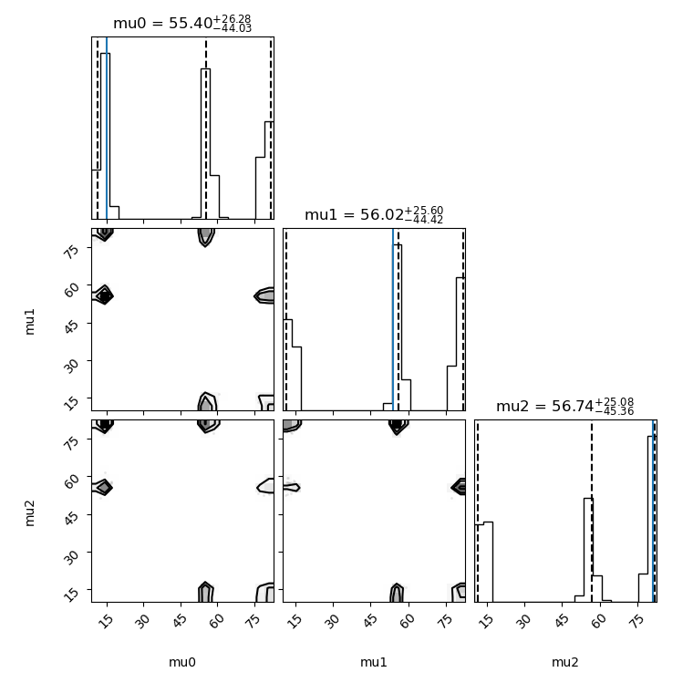
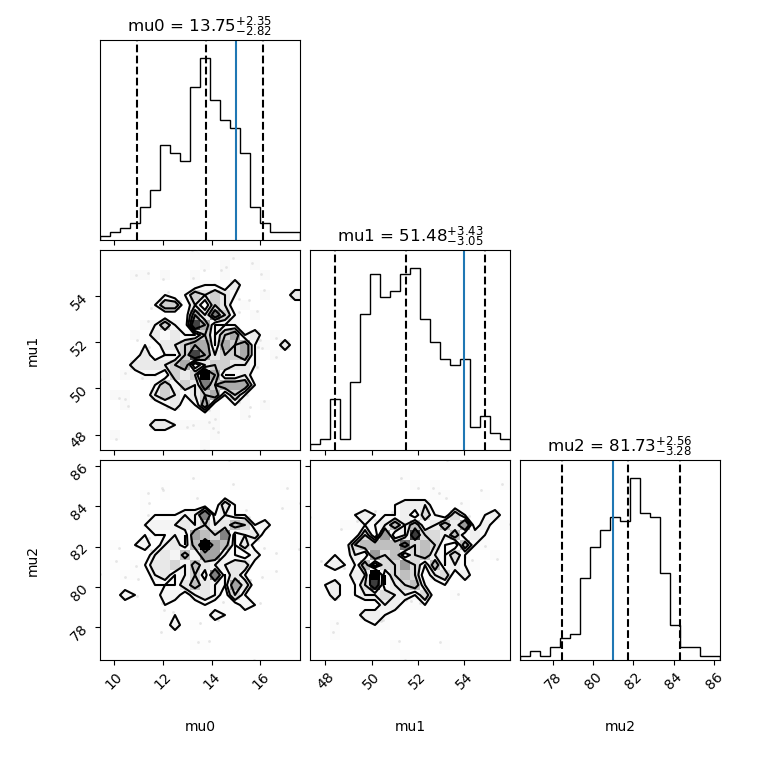

# tbilby-sw

This is tbilby examples/tutorial page:
Below are some of the results that can be obtained using the avilable python scripts.
<figure>
	
	<figcaption>Three Guassian Basic example</figcaption>
</figure>

	
		
			
					
	

		
Three Guassian Intermediate example ("Note that the number of component functions is taken before weights,
	 to show that the sampler considered alternative options. )

	

					
			
	

	Three Guassian Advanced example	

